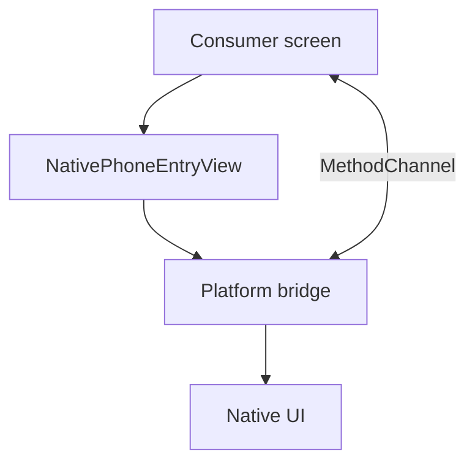

# Architecture

## Layers

| Layer | Location | Responsibility |
|-------|----------|----------------|
| UI | `ios/Classes/UI/`, `android/.../ui/` | Layout, validation display, user taps |
| Bridge | `PhoneEntryPlatformView` | Owns channel, maps events, `dispose()` cleanup |
| Dart API | `lib/src/` | Public widget, typed models, controller |

## Engineering rules

| Rule | Enforcement |
|------|-------------|
| Simple control flow | Early return in bridge handlers |
| No build-time allocation | Static `gestureRecognizers`, stable `ValueKey` |
| Functions ≤ ~60 lines | Split UI / bridge / factory files |
| Smallest scope | Per-view channel suffix `_<viewId>` |
| Cleanup | `dispose()` clears `setMethodCallHandler(null)` |
| Typed payloads | `PhoneSubmission`, not raw maps in public API |

## Adding another PlatformView

1. Add `ViewTypes` constant and register a new factory in `HovrNativePlatformViewPlugin` (iOS + Android).
2. Create `UI/` + bridge classes under platform directories.
3. Expose a new public widget and channel helper in `lib/`.
4. Extend `tool/check_channel_contract.dart` and `doc/CHANNEL_CONTRACT.md`.
